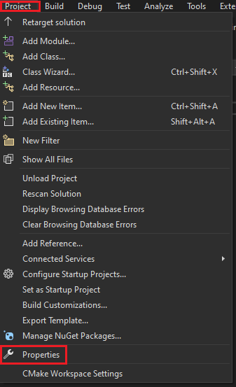
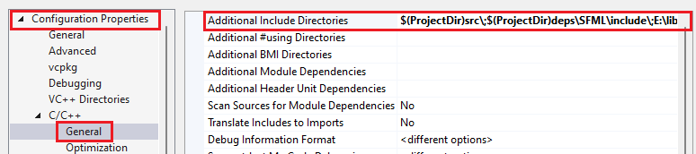

# AimGame

# For Developers
- Download project
    ```
    git clone git@github.com:asiangoldfish/Engine.git
    ```
- Download the [SFML library](https://www.sfml-dev.org/download.php) version 2.5.1
- Extract the library at [src/SfmlProject/deps/SFML](./src/SfmlProject/deps/SFML)

# Networking
Networking test is the project for networking with asio.

## Installing asio
1. Download the library [here](https://sourceforge.net/projects/asio/) and extract it. Copy the extracted directory. We need this for the next step.
2. In Visual Studio, open the Project Properties: *Project -> Property*:

    

    Then, navigate to: *Configuration Properties -> C/C++ -> General*. Paste the extracted directory path in *Additional Include Directories*:

    

    Remember to separate each argument with a semicolon `;`.


# Game launcher tutorial